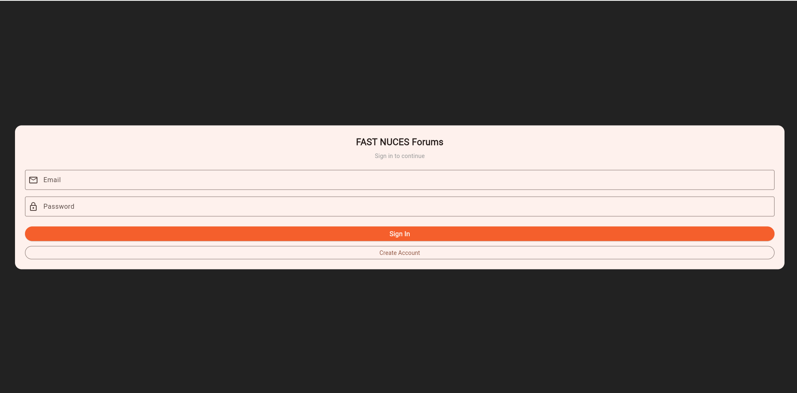
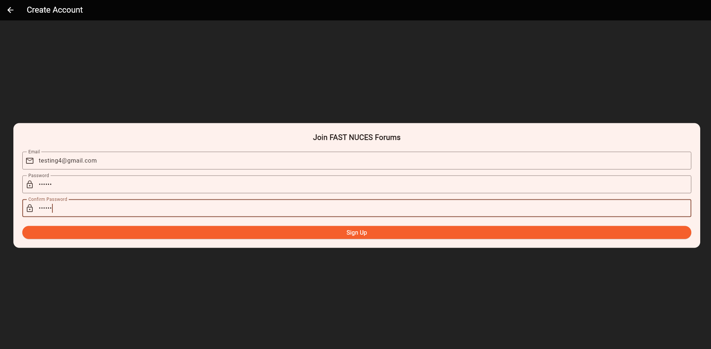
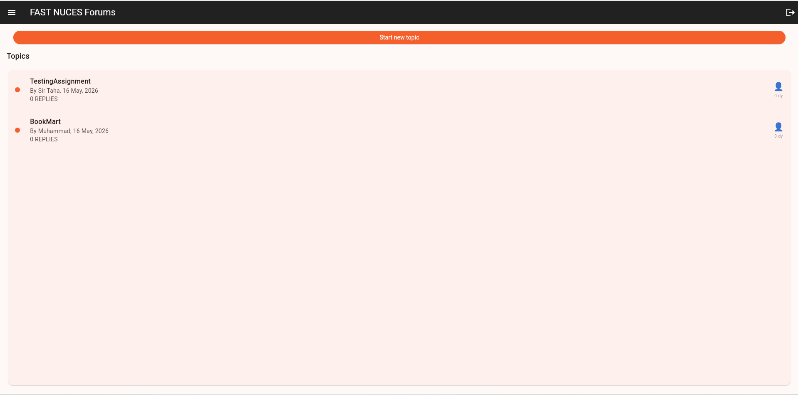
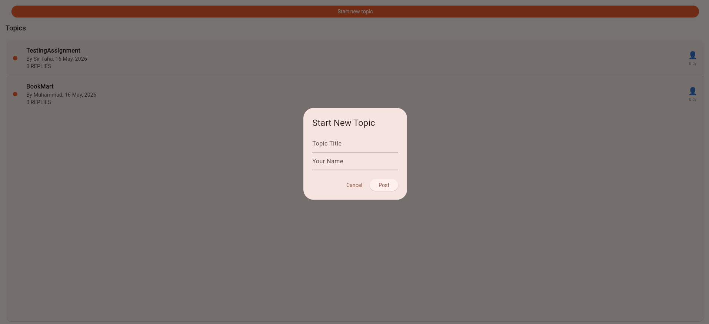
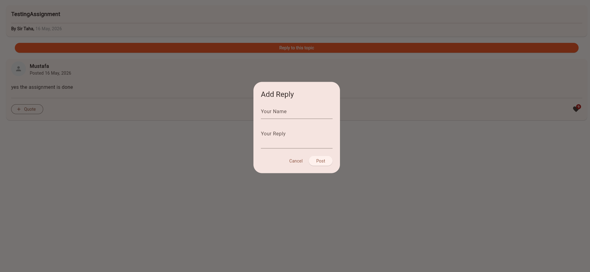
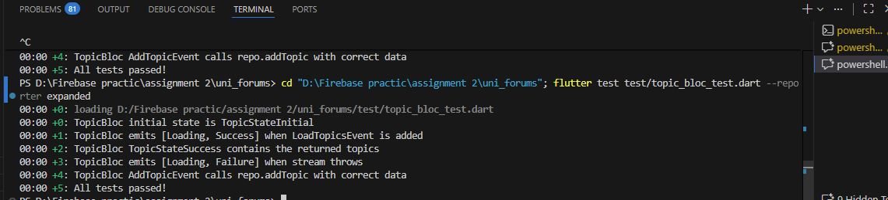

# 🎓 FAST NUCES Forums — Flutter Assignment #2

**Course:** Software Engineering / Mobile Application Development  
**Semester:** Spring 2026

---

## 👥 Group Members

| Name | Roll Number |
|------|-------------|
| Muhammad Mustafa Shahzad | K224166 |
| Muhammad Umar Farooq | K224218 |
| S M Abubakar Burhan | K224184 |

---

## 📱 App Overview

A fully functional **university forum application** built with Flutter, Firebase Firestore, Firebase Authentication, and BLoC state management. Users can sign up, post topics, reply to discussions, and like replies — all in real time.

## 📸 Screenshots

### 🔐 Authentication
| Login Page | Sign Up Page |
|:----------:|:------------:|
|  |  |

### 📋 Forum
| Topics List | Start New Topic |
|:-----------:|:---------------:|
|  |  |

### 💬 Replies & Likes
| Reply Page with Add Reply & Likes |
|:---------------------------------:|
|  |

### 🧪 Mockito Unit Tests
| All 5 Tests Passing |
|:-------------------:|
|  |

---

## 🏗️ Architecture

This project follows the **Repository Pattern** with a clean separation of concerns:

```
assignment 2/
├── uni_forums/              ← Main Flutter App (UI + BLoC)
│   ├── lib/
│   │   ├── main.dart            ← App entry, AuthGate, ForumsHome
│   │   ├── login_page.dart      ← Login + Signup screens
│   │   ├── replies_page.dart    ← Topic replies screen
│   │   ├── utility.dart         ← Date formatting helpers
│   │   ├── blocs/
│   │   │   ├── auth/            ← AuthBloc (sign in/up/out)
│   │   │   ├── topic/           ← TopicBloc (load/add topics)
│   │   │   └── reply/           ← ReplyBloc (load/add/like replies)
│   │   └── firebase_options.dart
│   └── test/
│       └── topic_bloc_test.dart ← Mockito unit tests
│
└── forum_firebase_pkg/      ← Local Flutter Package (Firebase logic)
    └── lib/
        ├── models/
        │   ├── topic_model.dart     ← TopicModel with fromDoc/toMap
        │   └── reply_model.dart     ← ReplyModel with fromDoc/toMap
        ├── repositories/            ← Abstract contracts (interfaces)
        │   ├── auth_repository.dart
        │   ├── topic_repository.dart
        │   └── reply_repository.dart
        └── implementations/         ← Firebase concrete implementations
            ├── firebase_auth_repository.dart
            ├── firebase_topic_repository.dart
            └── firebase_reply_repository.dart
```

---

## ✅ Features Implemented

- 🔐 **Firebase Authentication** — Email/Password sign up & sign in
- 📋 **Topics Feed** — Real-time list of forum topics from Firestore
- 💬 **Replies** — Add replies to any topic, shown in real time
- ❤️ **Likes** — Like any reply; count updates live in Firestore
- ✅ **Form Validation** — All inputs validated with error messages
- ⏳ **Loading States** — Spinners shown while fetching/posting data
- 🚪 **Auth Gate** — Auto redirects to login or forums based on auth state
- 🧪 **Mockito Tests** — 5 unit tests for TopicBloc using mock repository

---

## 🧠 Key Patterns Used

### 1. Repository Pattern
```dart
// Abstract contract — the app depends on this, NOT on Firebase directly
abstract class TopicRepository {
  Stream<List<TopicModel>> getTopics();
  Future<void> addTopic(TopicModel topic);
}

// Firebase implementation — only this file touches Firestore
class FirebaseTopicRepository implements TopicRepository {
  final _db = FirebaseFirestore.instance;

  @override
  Stream<List<TopicModel>> getTopics() =>
      _db.collection('topics').snapshots().map(
        (snap) => snap.docs.map(TopicModel.fromDoc).toList(),
      );
}
```

### 2. BLoC State Management
```dart
// Events tell the BLoC WHAT happened
class LoadTopicsEvent extends TopicEvent {}
class AddTopicEvent extends TopicEvent { ... }

// States tell the UI WHAT to show
class TopicStateLoading extends TopicState {}
class TopicStateSuccess extends TopicState { final List<TopicModel> topics; }
class TopicStateFailure extends TopicState { final String error; }

// BLoC reacts to events and emits states
class TopicBloc extends Bloc<TopicEvent, TopicState> {
  TopicBloc({required TopicRepository repo}) : super(TopicStateInitial()) {
    on<LoadTopicsEvent>((event, emit) async {
      emit(TopicStateLoading());
      await emit.forEach(repo.getTopics(), onData: TopicStateSuccess.new);
    });
  }
}
```

### 3. Mockito Unit Tests (AAA Pattern)
```dart
@GenerateMocks([TopicRepository])
void main() {
  test('emits [Loading, Success] when topics loaded', () {
    // ARRANGE — fake the dependency
    when(mockRepo.getTopics()).thenAnswer((_) => Stream.value([fakeTopic]));

    // ACT — trigger the event
    bloc.add(LoadTopicsEvent());

    // ASSERT — check emitted states
    expect(bloc.stream, emitsInOrder([isA<TopicStateLoading>(), isA<TopicStateSuccess>()]));
  });
}
```

---

## 📦 Packages Used

| Package | Purpose |
|---------|---------|
| `flutter_bloc` | BLoC state management |
| `firebase_core` | Firebase initialization |
| `firebase_auth` | Email/Password authentication |
| `cloud_firestore` | Real-time NoSQL database |
| `mockito` | Mock objects for unit testing |
| `bloc_test` | BLoC-specific test helpers |
| `equatable` | Value equality for states |

---

## 🔥 Firebase Structure

```
Firestore Database
└── topics/                     ← Collection
    └── {topicId}/              ← Document
        ├── title: string
        ├── originalPoster: string
        ├── creationDate: timestamp
        ├── isNew: bool
        ├── replyCount: number
        └── replies/            ← Sub-collection
            └── {replyId}/
                ├── content: string
                ├── replier: string
                ├── replyDate: timestamp
                ├── avatarUrl: string
                └── likes: number
```

---

## 🚀 Running the App

```bash
# 1. Get dependencies for both packages
cd forum_firebase_pkg && flutter pub get
cd ../uni_forums && flutter pub get

# 2. Run on Chrome
flutter run -d chrome

# 3. Run unit tests
flutter test test/topic_bloc_test.dart
```

---

## 🧪 Test Results

```
✅ initial state is TopicStateInitial
✅ emits [Loading, Success] when LoadTopicsEvent is added
✅ TopicStateSuccess contains the returned topics
✅ emits [Loading, Failure] when stream throws
✅ AddTopicEvent calls repo.addTopic with correct data

5/5 tests passed
```
